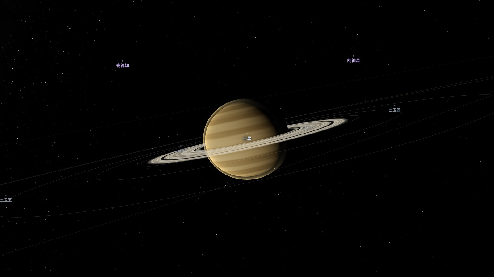
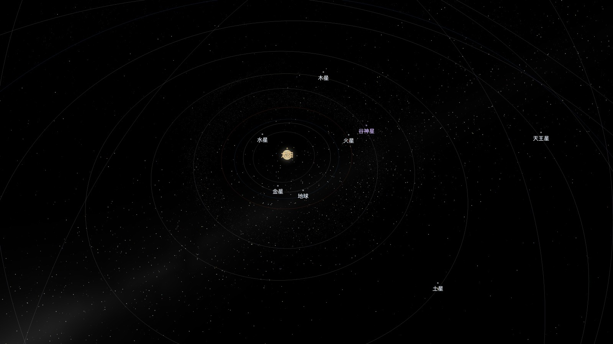
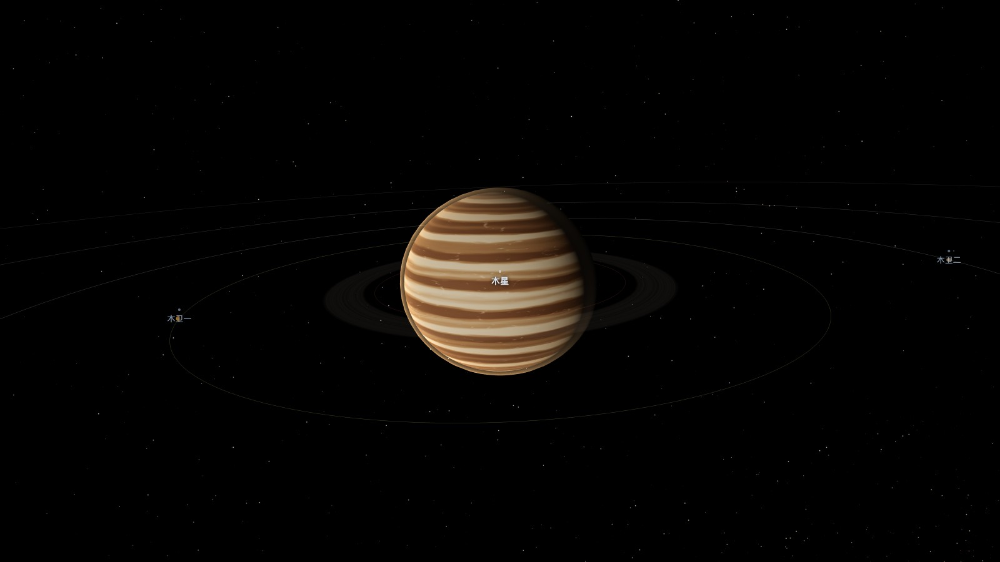
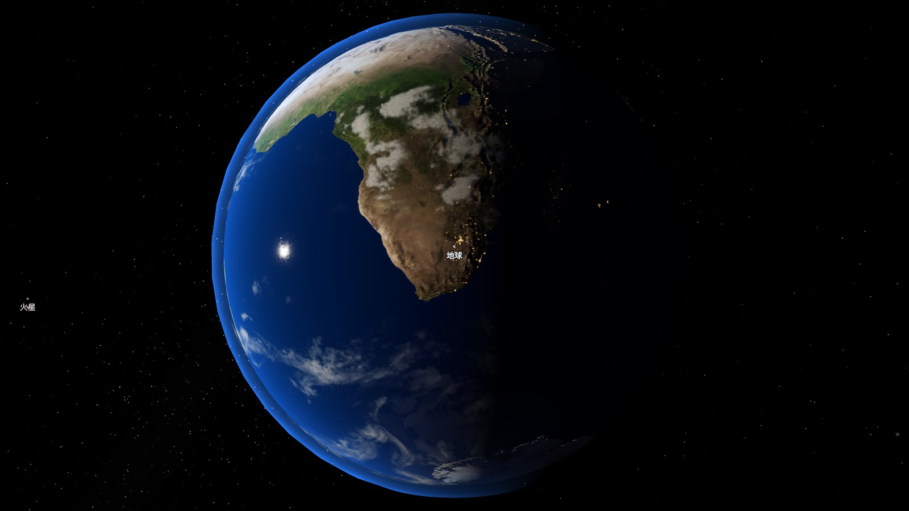
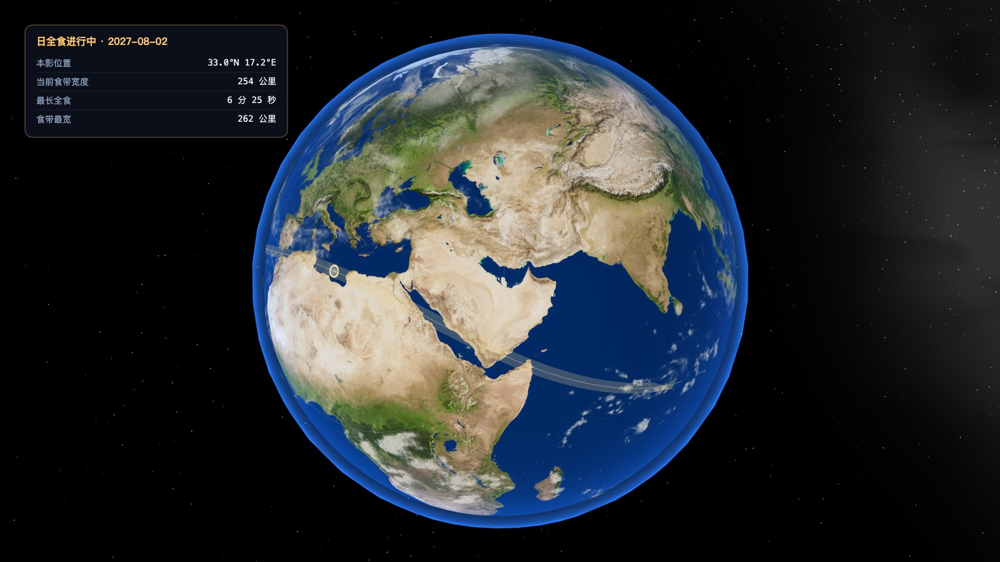
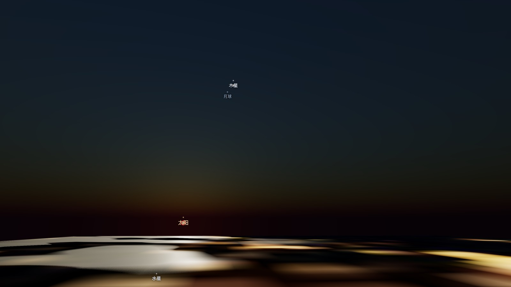

<div align="center">

# Solar Explorer

**An interactive 3-D solar system driven by real ephemerides.**

Planets, moons, dwarf planets and comets move on their actual orbits and spin at their
actual rates. Wind the clock to any moment and read off the sunrise where you live,
the next eclipse, or the track its shadow will sweep across the ground.

[](LICENSE)
[](https://www.typescriptlang.org/)
[](https://threejs.org/)
[](https://vite.dev/)
[](#accuracy-and-sources)

[中文说明](README.zh-CN.md) · [Quick start](#quick-start) · [Accuracy](#accuracy-and-sources) · [Architecture](#architecture)



</div>

---

## What it is

A single-page website, no backend and no API calls: every position, rotation angle,
rise time and eclipse contact is computed in the browser from published astronomical
theory. The interface is in Chinese, aimed at popular-science reading; the astronomy
underneath is language-neutral and covered by 112 tests against published values.

## Features

### The whole system, to scale or in view

Eight planets, 8 dwarf planets, 29 major moons and 8 well-known comets, plus the main
asteroid belt with its Kirkwood gaps, Jupiter's Trojan swarms, the Kuiper belt, the
scattered disc and a marker for the inner edge of the Oort cloud. Switch between true
scale — which is mostly empty space, and honest about it — and a compressed view that
keeps everything reachable. Each class of body can be shown or hidden on its own.



### Real positions, at any moment

Positions and rotation angles come from the ephemeris, not from an animation loop.
Run time forwards or backwards at ten speeds from real time to a decade a second,
or jump straight to a date. The clock says so when you leave the window the planetary
element set was fitted to.



### Sunrise, sunset and the local sky

Pick a place and get rise, transit, set, day length, the three twilight phases,
moonrise, moonset and the moon's phase — polar day and night included. Every other
world answers the same question for itself: how long its solar day is (24.66 h on Mars,
about 29.5 Earth days on the Moon, 176 on Mercury) and when the Sun next rises where
you are standing on it.



*Photographic maps are optional. With them the Earth carries its day map, cloud layer,
city lights on the night side and an ocean that catches the Sun; without them every body
falls back to a procedurally generated surface.*

### Eclipses, and where their shadows fall

The next eclipses with type, magnitude, contact times and what is actually visible from
your location. During a solar eclipse the band of totality is drawn on the globe at its
real width, the umbra travels along it as the clock runs, and the edge of the penumbra
shows who sees a partial eclipse. Shadow shading is computed per fragment from true
angular geometry, so it is the right size whatever scale the scene is drawn at — the
same code puts Io's shadow on Jupiter.



### Stand on the surface

Put yourself on Earth, Mars or the Moon and look up. The sky uses the Preetham daylight
model rotated to your local vertical, stars fade as the Sun climbs, and the view switches
to true scale so the Sun and Moon subtend the angles they really do. Watch the sunrise
you just read off the almanac actually happen.



### Everywhere

Mouse and keyboard on the desktop, one-finger rotate and two-finger pinch on a phone,
with the panels folding into a bottom sheet below 900 px.

## Quick start

```bash
git clone https://github.com/hugogu/solar-explorer.git
cd solar-explorer
npm install
npm run dev
```

Open <http://localhost:5173>.

Optionally fetch the photographic maps for the Earth and the Moon — public-domain
NASA imagery, redistributed by the three.js repository. Everything works without this
step; every body has a procedurally generated surface as a fallback.

```bash
npm run fetch-textures
```

Production build:

```bash
npm run build && npm run preview
```

## Controls

| Input | Action |
| --- | --- |
| Drag / one finger | Rotate |
| Wheel / pinch | Zoom |
| Click a body or its label | Select and follow |
| `Space` | Play / pause |
| `[` `]` | Slower / faster |
| Arrow keys or `WASD` | Rotate |
| `Q` `E` or `+` `-` | Zoom |
| `1`–`9` | Jump to the planets, then Pluto |
| `0` | Back to the Sun |
| `R` or the ⟲ button | Run time backwards |
| `L` / `O` | Toggle labels / orbits |
| `Esc` | Stop following, leave the surface view |

## Accuracy and sources

Everything is computed in the browser. Nothing is fetched from an ephemeris service.

| Quantity | Method | Agreement with published values |
| --- | --- | --- |
| Sun | Truncated VSOP87D Earth series, FK5 correction, nutation, aberration | Season instants within a minute |
| Moon | Truncated ELP-2000/82, Meeus ch. 47 | Reproduces example 47.a exactly |
| Planets | JPL approximate elements | ~1′ over 1800–2050 |
| Earth's rotation | Apparent sidereal time and precession | Matches the rise/set path to 0.02° |
| Other rotations | IAU/WGCCRE elements, with lunar libration | Degree level |
| Rise / set / twilight | Root-finding on solar altitude | Beijing solstices to the minute |
| Eclipse prediction | Meeus ch. 54; local circumstances from the topocentric discs | Greatest eclipse within a minute |
| Eclipse tracks | Shadow axis solved against the ellipsoid; central duration measured directly | Within 1–3% |
| Oppositions | Root-finding on geocentric ecliptic longitude | Mars 2027-02-19, Jupiter 2027-02-11 |

A few worked examples, checked in `tests/`:

- The 2027-08-02 total eclipse: greatest eclipse over Egypt at 25.4°N 33.1°E, maximum
  totality **386 s** against a published 383 s, track width 262 km against 258 km.
- The 2027-02-06 annular eclipse: maximum annularity **471 s**, published 471 s.
- The 2030-11-25 total eclipse: the track runs from the South Atlantic across southern
  Africa and the Indian Ocean to landfall in Queensland.
- Fifteen catalogued eclipses from 2023 to 2027, by date, type and time of greatest eclipse.

```bash
npm test
```

### Known approximations

Stated here and in the interface, rather than glossed over.

- **Orbital phase.** Element sets — semi-major axis, eccentricity, inclination, period —
  are the published values for every body. The epoch phase is only a real ephemeris value
  for the planets, the Moon, the comets (anchored on observed perihelion passages) and
  Jupiter's Galilean moons. For the remaining moons and the dwarf planets it is an
  estimate, so *where along its orbit* such a body sits is indicative.
- **Track width.** No lunar limb profile correction is applied. For grazing eclipses the
  across-track width is poorly defined in the first place and comes out noticeably wider
  than the canon; the central duration still agrees within 3%.
- **Belts.** The asteroid and Kuiper belts are populations generated to match the real
  orbital distribution. They are not catalogued objects.
- **Earth's orbit line** is the Earth–Moon barycentre's, which the Earth genuinely swings
  around by 4670 km — so the globe sits a few pixels off its own drawn orbit.

## Architecture

```
src/
  astro/    pure computation: time scales, frames, orbits, Sun, Moon, planets,
            rotation, rise/set, eclipses, eclipse tracks, galactic coordinates
  data/     body catalogue: physical and orbital parameters, popular-science content
  app/      simulation state, clock, application state, eclipse watcher
  render/   three.js scene: bodies, orbits, sky, belts, camera, procedural textures
  ui/       panels, built from plain DOM with no framework
tests/      checks against published values
scripts/    optional texture download
```

Two rules hold the design together:

- `src/astro/` imports neither three.js nor the DOM, so it runs and is tested in Node.
- The render layer does no astronomy. It consumes positions and orientations from
  `Simulation` and draws them.

One scene unit is 1000 km. The ephemeris works in the ecliptic frame with +Z towards the
ecliptic north pole; three.js is Y-up, so `(x, y, z)` becomes `(x, z, -y)`.

## Development

```bash
npm run dev              # dev server
npm test                 # 112 tests against published values
npm run lint             # eslint
npm run build            # type-check and production build
npm run fetch-textures   # optional photographic maps
```

`AGENTS.md` records the non-obvious things that cost time to work out — the shader
chunks a custom material needs under a logarithmic depth buffer, why the camera must
publish its matrix before anything projects against it, why the central-eclipse test
has to be geometric rather than a coverage threshold, and more.

## Contributing

Issues and pull requests are welcome. Two things worth knowing before you open one:

1. **Run the tests.** They compare against published values — Meeus worked examples,
   almanac rise/set times, the eclipse canon — not against snapshots. A failure usually
   means something is genuinely wrong, not that a fixture needs updating.
2. **Be explicit about approximations.** If a change trades accuracy for appearance, say
   so in the code and surface it in the interface. The project's value is that its
   numbers can be trusted.

## Licence

MIT — see [LICENSE](LICENSE).

Imagery downloaded by `npm run fetch-textures` is public-domain NASA/JPL material,
redistributed by the [three.js](https://github.com/mrdoob/three.js) repository.

## Acknowledgements

- Jean Meeus, *Astronomical Algorithms* — the lunar theory, eclipse prediction and much else.
- Bretagnon & Francou, VSOP87.
- JPL Solar System Dynamics, *Approximate Positions of the Major Planets*.
- The IAU Working Group on Cartographic Coordinates and Rotational Elements.
- Preetham, Shirley & Smits, *A Practical Analytic Model for Daylight*, via three.js.
